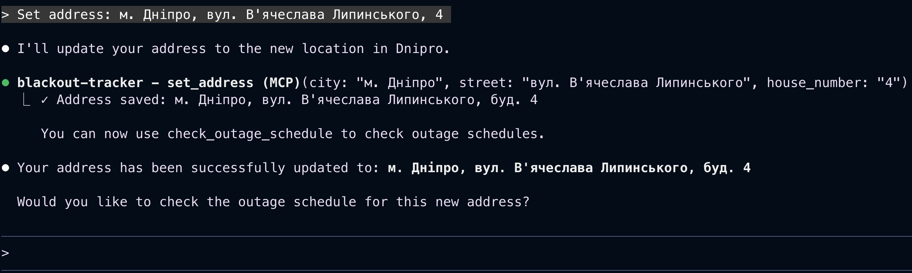
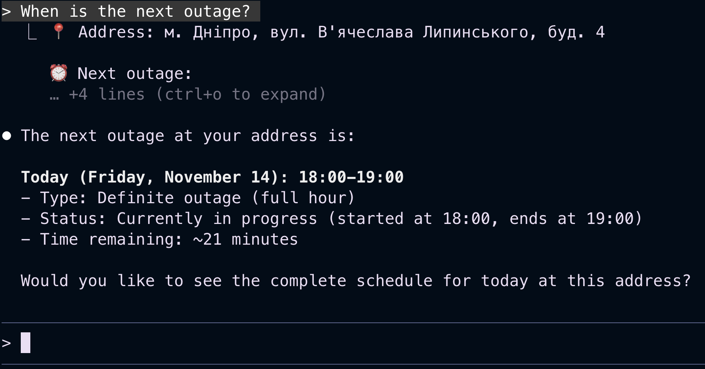
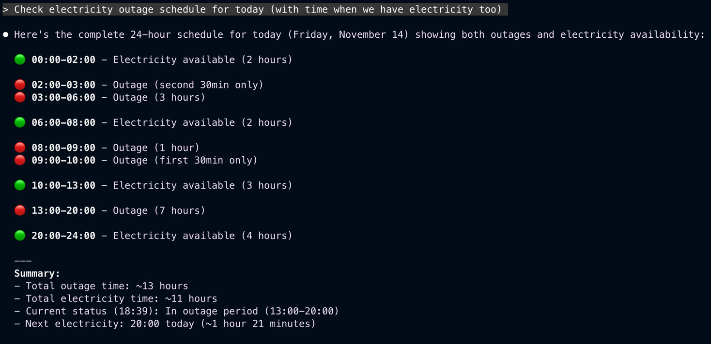
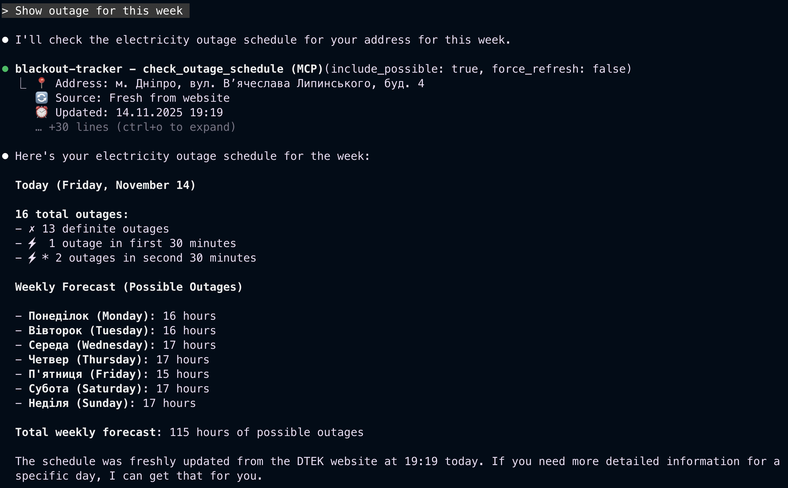
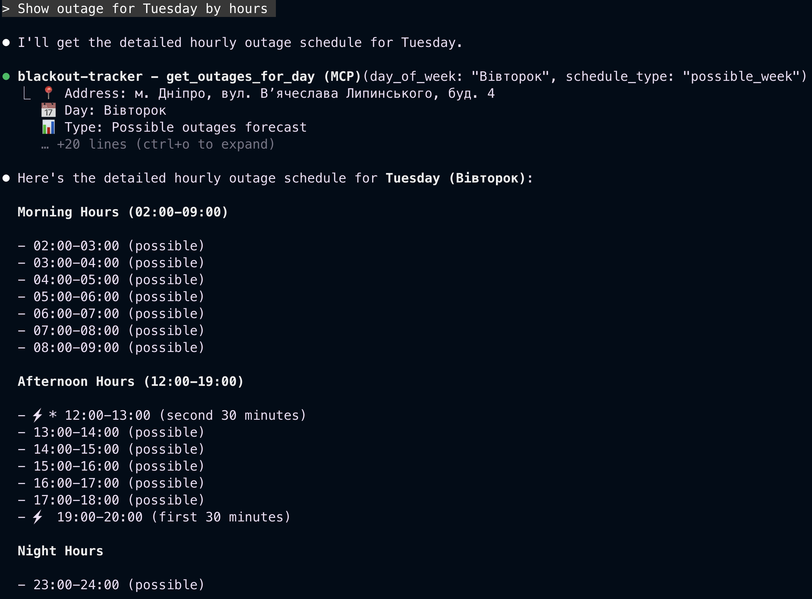
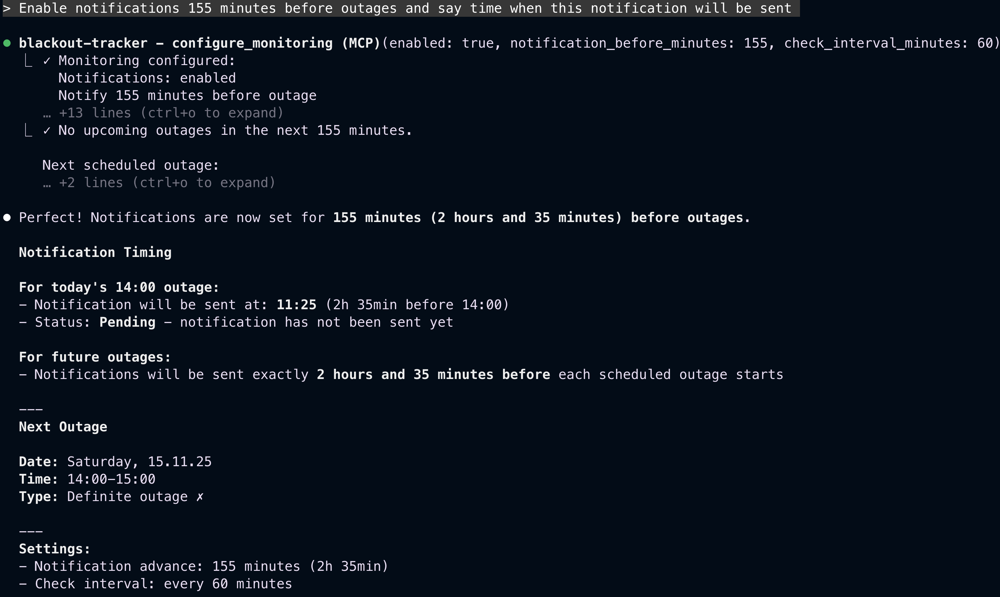
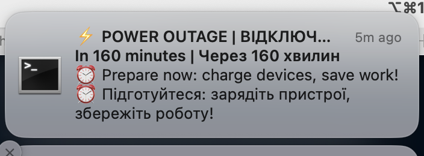

# Electricity Shutdowns MCP Server

An MCP server for monitoring electricity outage schedules in Ukraine (DTEK Dnipro Electric Networks). Currently, supports Dnipropetrovsk region only.

## Table of Contents

- [Description](#description)
- [Claude Code Setup](#claude-code-setup)
  - [Option A: Using Docker (Recommended)](#option-a-using-docker-recommended-for-daily-use)
  - [Option B: Using Local Python Environment](#option-b-using-local-python-environment-for-development)
  - [Alternative: Using mcp.json](#alternative-using-mcpjson-quick-testing)
- [Usage](#usage)
  - [Basic Workflow](#basic-workflow)
  - [Usage Examples](#usage-examples)
- [Available Tools](#available-tools)
  - [set_address](#set_address)
  - [check_outage_schedule](#check_outage_schedule)
  - [get_next_outage](#get_next_outage)
  - [get_outages_for_day](#get_outages_for_day)
- [Data Source](#data-source)
  - [Schedule Types](#schedule-types)
  - [Outage Types](#outage-types)
- [Configuration & Data Storage](#configuration--data-storage)
- [Project Structure](#project-structure)
- [Troubleshooting](#troubleshooting)
- [Development](#development)
- [Roadmap](#roadmap)
- [Resources](#resources)
- [Authors](#authors)
- [Support](#support)

## Description

This MCP server helps track scheduled electricity outages and provides timely notifications about upcoming shutdowns. Especially useful for planning laptop charging and managing other devices during power outages.

## Demo video link to google drive:

https://drive.google.com/file/d/1RsHJWdFBvEGF-KOu3yS7BWbEXgPU-E2V/view?usp=sharing

## Screenshots

- Set address:



- Check next electricity outage:



- Check electricity outage for specific date:


- Check outage for this week (possible outages):


- Check outage for specific day by hours:


- Configure monitoring (enable notifications):


- Notification about upcoming outage:


### Key Features

- 🔍 **Schedule Checking** - Get outage schedules for your specific address
- ⏰ **Automatic Notifications** - Background daemon starts automatically with `docker-compose up`!
- 🤖 **Terminal Notifications** - Visual notifications in your terminal (iTerm2/Terminal.app)
- 📊 **Real-time Monitoring** - Daemon checks schedule every N minutes
- 🌐 **Live Data** - Direct parsing from DTEK website
- 💾 **Smart Caching** - 1-hour cache to reduce load
- 🐳 **Zero Configuration** - Everything works out of the box with Docker

## Claude Code Setup

Choose one of the following approaches based on your needs:

### Option A: Using Docker (Recommended for Daily Use)

**Best for:** Production/home use, no need to manage Python dependencies

**Prerequisites:**
- Docker installed ([Get Docker](https://docs.docker.com/get-docker/))
- Docker Compose (usually comes with Docker Desktop)
- For macOS: terminal-notifier (`brew install terminal-notifier`). This needed because docker containers run in an isolated environment and cannot directly access macOS system APIs

**Step-by-step setup:**

**1. Clone the repository:**
```bash
git clone <repository-url>
cd blackout_tracker_mcp
```

**2. Build the Docker image:**
```bash
docker-compose build
```

**3. Start both MCP server and notification daemon:**
```bash
docker-compose up -d
./watch_notifications.sh

# or:
docker-compose up -d mcp-server && docker-compose up -d notification-daemon && ./watch_notifications.sh

```

This will start:
- `mcp-server` - Main MCP server (handles Claude requests)
- `notification-daemon` - Background notification daemon (monitors for outages)

**4. Configure Claude:**

Open your Claude configuration file (`code ~/.claude.json`) and add:

```json
{
  "mcpServers": {
    "blackout-tracker": {
      "type": "stdio",
      "command": "docker",
      "args": [
        "exec",
        "-i",
        "blackout-tracker-mcp",
        "python",
        "-m",
        "src.server"
      ]
    }
  }
}
```

**Important:**
- Add `"mcpServers"` at the **root level** of `~/.claude.json`, **before** the `"projects"` section (not inside it)
- This makes the MCP server available globally across all projects
- The notification daemon runs automatically in background!

**5. Restart Claude Code/Desktop** and check `claude mcp list`

**That's it!** No absolute paths needed. Docker handles everything.

**Useful Docker commands:**
```bash
# View MCP server logs
docker-compose logs -f mcp-server

# View notification daemon logs (see monitoring in action!)
docker-compose logs -f notification-daemon

# View both logs together
docker-compose logs -f

# Stop all services
docker-compose down

# Restart MCP server after code changes
docker-compose restart mcp-server

# Restart notification daemon
docker-compose restart notification-daemon

# Run tests
docker-compose --profile test run --rm test-runner
# Or run one test specifically:
docker exec -i blackout-tracker-mcp python tests/test_apostrophe_normalization.py
```

**Notification Daemon:**
The notification daemon automatically:
- Starts when you run `docker-compose up -d`
- Checks for upcoming outages every N minutes (configurable)
- Sends terminal notifications when outage is approaching
- Keeps running in background even when Claude is closed

#### macOS Native Notifications

**Why Docker Can't Send macOS Notifications Directly:**

Docker containers run in an isolated environment and cannot directly access macOS system APIs, including the Notification Center. The daemon running inside Docker can only write to logs and stdout, which is why we need a bridge solution to forward notifications to your macOS Notification Center.

**Solution: Using terminal-notifier + watch script**

To receive native macOS notifications in Notification Center:

**1. Install terminal-notifier:**

```bash
brew install terminal-notifier
```

This tool allows sending notifications to macOS Notification Center from the command line.

**2. Run the notification watch script:**

The `watch_notifications.sh` script monitors Docker daemon logs and forwards notifications to macOS:

**Manual (one-time) execution:**
```bash
./watch_notifications.sh
```

This will:
- Monitor the `blackout-notifier` container logs in real-time
- Detect when the daemon sends notifications (by watching for "Notification sent at HH:MM:SS")
- Send native macOS notifications via terminal-notifier
- Send only ONE notification per outage (no duplicates)

Press `Ctrl+C` to stop watching.

**3. OPTIONAL: Automatic startup on system login (LaunchAgent):**

To have notifications start automatically when you log in to macOS:

**Create LaunchAgent plist file:**
```bash
mkdir -p ~/Library/LaunchAgents
```

Create `~/Library/LaunchAgents/com.blackout.notifier.plist`:
```xml
<?xml version="1.0" encoding="UTF-8"?>
<!DOCTYPE plist PUBLIC "-//Apple//DTD PLIST 1.0//EN" "http://www.apple.com/DTDs/PropertyList-1.0.dtd">
<plist version="1.0">
<dict>
    <key>Label</key>
    <string>com.blackout.notifier</string>
    <key>ProgramArguments</key>
    <array>
        <string>/bin/bash</string>
        <string>/ABSOLUTE/PATH/TO/PROJECT/watch_notifications.sh</string>
    </array>
    <key>RunAtLoad</key>
    <true/>
    <key>KeepAlive</key>
    <true/>
    <key>StandardOutPath</key>
    <string>/tmp/blackout-notifier-watch.log</string>
    <key>StandardErrorPath</key>
    <string>/tmp/blackout-notifier-watch-error.log</string>
    <key>WorkingDirectory</key>
    <string>/ABSOLUTE/PATH/TO/PROJECT</string>
</dict>
</plist>
```

**Important:** Replace `/ABSOLUTE/PATH/TO/PROJECT` with your actual project path.

**Load the LaunchAgent:**
```bash
launchctl load ~/Library/LaunchAgents/com.blackout.notifier.plist
```

**Verify it's running:**
```bash
launchctl list | grep blackout
```

**Stop the LaunchAgent (if needed):**
```bash
launchctl unload ~/Library/LaunchAgents/com.blackout.notifier.plist
```

**View logs:**
```bash
tail -f /tmp/blackout-notifier-watch.log
```

**How It Works:**

1. **Daemon** (in Docker) checks for outages and writes "Notification sent at HH:MM:SS" to logs
2. **Watch script** (on macOS host) monitors Docker logs via `docker logs -f`
3. **Script detects** new notification by timestamp (no duplicates)
4. **terminal-notifier** sends native macOS notification with sound

**Notification Details:**
- **Title**: "⚡ ВІДКЛЮЧЕННЯ СВІТЛА"
- **Subtitle**: ""In $minutes minutes | Через $minutes хвилин
- **Message**: "⏰ Prepare now: charge devices, save work! ⏰ Підготуйтеся: зарядіть пристрої, збережіть роботу!"
- **Sound**: "Sosumi"
- **Grouped**: All notifications grouped as "power-outage" (only most recent visible)

**Important Notes:**
- Only ONE notification per outage is sent (the watch script prevents duplicates by tracking timestamps)
- Notifications arrive a few seconds after the daemon detects the outage
- Make sure Docker containers are running: `docker-compose up -d`
- The daemon must have monitoring enabled (see usage examples above)

---

### Option B: Using Local Python Environment (For Development)

**Best for:** Development, testing, debugging

**Prerequisites:**
- Python 3.11+ installed
- Internet connection to access DTEK website

**Step-by-step setup:**

**1. Clone the repository:**
```bash
git clone <repository-url>
cd blackout_tracker_mcp
```

**2. Create virtual environment:**
```bash
python3 -m venv venv
source venv/bin/activate  # On Windows: venv\Scripts\activate
```

**3. Install dependencies:**
```bash
pip install -r requirements.txt
```

**4. Install Playwright browser:**
```bash
playwright install chromium
```

**5. Verify installation:**
```bash
python tests/test_mcp_server.py
```

You should see: `✓ ALL VALIDATIONS PASSED`

**6. Configure Claude:**

Open your Claude configuration file (`code ~/.claude.json`) and add:

```json
{
  "mcpServers": {
    "blackout-tracker": {
      "type": "stdio",
      "command": "/ABSOLUTE/PATH/TO/PROJECT/venv/bin/python",
      "args": ["-m", "src.server"],
      "cwd": "/ABSOLUTE/PATH/TO/PROJECT",
      "env": {}
    }
  }
}
```

**Important:**
- Replace `/ABSOLUTE/PATH/TO/PROJECT/` with the actual path to your project.
- Add `"mcpServers"` at the **root level** of `~/.claude.json`, **before** the `"projects"` section (not inside it). This makes the MCP server available globally across all projects.

**How to find your absolute path:**
```bash
cd blackout_tracker_mcp
pwd  # This shows your absolute path
```

**Example for macOS/Linux:**
```json
{
  "mcpServers": {
    "blackout-tracker": {
      "type": "stdio",
      "command": "/Users/john/projects/blackout_tracker_mcp/venv/bin/python",
      "args": ["-m", "src.server"],
      "cwd": "/Users/john/projects/blackout_tracker_mcp",
      "env": {}
    }
  }
}
```

**Example for Windows:**
```json
{
  "mcpServers": {
    "blackout-tracker": {
      "type": "stdio",
      "command": "C:\\Users\\john\\projects\\blackout_tracker_mcp\\venv\\Scripts\\python.exe",
      "args": ["-m", "src.server"],
      "cwd": "C:\\Users\\john\\projects\\blackout_tracker_mcp",
      "env": {}
    }
  }
}
```

**7. Restart Claude Code/Desktop**

---

### Alternative: Using mcp.json (Quick Testing)

If there's an `mcp.json` file in your project directory, Claude Code will automatically detect and offer to use the MCP server when you open the project folder.

This is the fastest way to test during development.

### Verification

After connecting the MCP server, you'll see available tools:
- `set_address` - Configure your address
- `check_outage_schedule` - Check outage schedules
- `get_next_outage` - Find the next upcoming outage
- `get_outages_for_day` - Get all outages for a specific day
- `configure_monitoring` - Configure notification settings
- `check_upcoming_outages` - Check for upcoming outages and get alerts

## Language Support

The MCP server supports **English** (default) and **Ukrainian** languages.

### Default Language

By default, all tool descriptions and responses are in **English**. This makes the server accessible to international users.

### Using Ukrainian Language

To use Ukrainian language, you need to configure it in the config file:

**1. Locate the config file:**
```bash
~/.config/blackout_tracker_mcp/config.json
```

**2. Add or modify the language setting:**
```json
{
  "language": "uk",
  "address": {
    "city": "м. Дніпро",
    "street": "вул. Вʼячеслава Липинського",
    "house_number": "4"
  }
}
```

**3. Restart the MCP server** (restart Claude Code/Desktop or Docker container)

### Commands in Both Languages

You can use natural language in either English or Ukrainian when talking to Claude. Here are examples:

#### English Commands:
```
Set my address to м. Дніпро, вул. В'ячеслава Липинського
Check electricity outage schedule
Check electricity outage schedule for today (with time when we have electricity too and summary)
When is the next outage?
Show all outages for Monday
Include possible outages for the week
Enable notifications 50 minutes before outages
```

#### Ukrainian Commands:
```
Встанови мою адресу: м. Дніпро, вул. Вʼячеслава Липинського, 4
Перевір графік відключень світла
Коли наступне відключення?
Покажи всі відключення на понеділок
Включи можливі відключення на тиждень
Увімкни сповіщення за 50 хвилин до відключень
```

**Note:** The language setting only affects the **output format** (tool descriptions and responses). You can speak to Claude in any language regardless of the configured language.

## Usage

### Basic Workflow

**1. Set Your Address:**

First, configure your address (note: use prefixes as they appear on DTEK website):

```
Set my address: м. Дніпро, вул. Вʼячеслава Липинського, 4
```

Claude will call `set_address` with the correct parameters.

**2. Check the Schedule:**

```
Check electricity outage schedule
When is the next outage?
```

Claude will call `check_outage_schedule` and show you the results.

### Usage Examples

#### Basic Usage

```
You: Set my address to м. Дніпро, Вʼячеслава Липинського, 4

Claude: [Calls set_address]
✓ Address saved: м. Дніпро, Вʼячеслава Липинського, 4

You: Check outage schedule

Claude: [Calls check_outage_schedule]
📍 Address: м. Дніпро, Вʼячеслава Липинського, 4
...
```

#### Advanced Usage

```
You: When is the next outage?

Claude: [Calls get_next_outage]
⏰ Next outage:
  14.11.25 Thursday, 18:00-19:00
  Type: Definite outage ✗
```

```
You: Show all outages for Monday

Claude: [Calls get_outages_for_day with day_of_week="Понеділок"]
📅 Day: Понеділок
Outages (5):
  ✗ 15.11.25 08:00-09:00 (definite)
  ...
```

```
You: Enable notifications 30 minutes before outages

Claude: [Calls configure_monitoring]
✓ Monitoring configured:
  Notifications: enabled
  Notify 30 minutes before outage
  Check interval: 60 minutes
  
  The notification daemon is now running automatically in Docker and will monitor your outage schedule. You'll receive an
   alert 47 minutes before any scheduled power outage at your address.

  Based on your next outage (01:00-02:00 tonight), you should receive a notification around 00:13 if the daemon picks it up in time.
```

**That's it!** The notification daemon (already running in background) will:
- Check schedule every 60 minutes (configurable)
- Send terminal notifications 30 minutes before outage
- Keep monitoring even when Claude is closed

**View daemon logs:**
```bash
docker-compose logs -f notification-daemon
```

You'll see output like:
```
[23:27:18] Check #1: Looking for upcoming outages...
✓ No upcoming outages in next 30 min
   Next check in 60 minutes
```

```
You: Check for upcoming outages

Claude: [Calls check_upcoming_outages]
⚠️ UPCOMING OUTAGE ALERT

Power outage starting in 25 minutes!

📅 14.11.25 Thursday
⏰ 18:00-19:00
📊 Definite outage ✗

Prepare now: charge devices, save work.
```

## Available Tools

### `set_address`

Configures the user's address for checking outage schedules.

**Parameters:**
- `city` (str): City with prefix (e.g., "м. Дніпро", "м. Київ")
- `street` (str): Street with prefix (e.g., "Просп. Миру", "Вул. Шевченка")
- `house_number` (str): House number (e.g., "4", "50а")

**Returns:** Confirmation of address saved

**Important:** Address is saved and used for all subsequent requests.

### `check_outage_schedule`

Checks the current outage schedule for the configured address.

**Parameters:**
- `include_possible` (bool, optional): Include weekly forecast (default: False)
- `force_refresh` (bool, optional): Force refresh data, ignoring cache (default: False)

**Returns:**
- Accurate schedule for today/tomorrow ("Графік відключень:")
- Optional: Weekly forecast ("Графік можливих відключень на тиждень:")
- Statistics by outage types
- Last update timestamp

**Caching:** Data is cached for 1 hour to speed up repeated requests.

### `get_next_outage`

Finds the next upcoming outage from the accurate schedule.

**Parameters:** None (uses configured address)

**Returns:**
- Date and day of week of next outage
- Start and end time
- Outage type (definite/first 30 min/second 30 min)

### `get_outages_for_day`

Gets all outages for a specific day of the week.

**Parameters:**
- `day_of_week` (str): Day of week in Ukrainian (Понеділок, Вівторок, Середа, Четвер, П'ятниця, Субота, Неділя)
- `schedule_type` (str, optional): Schedule type - "actual" (accurate) or "possible_week" (forecast). Default: "actual"

**Returns:** List of all outages for the specified day with times and types

### `configure_monitoring`

Configures notification and monitoring settings.

**Parameters:**
- `notification_before_minutes` (int, optional): How many minutes before outage to send notification. Default: 60
- `enabled` (bool, optional): Enable or disable monitoring notifications. Default: false
- `check_interval_minutes` (int, optional): How often to check for updates in minutes. Default: 60

**Returns:** Confirmation of monitoring settings

**Example:**
```
Configure monitoring: enable notifications 30 minutes before outages
```

### `check_upcoming_outages`

Checks for upcoming outages based on configured notification settings. Returns an alert if an outage is approaching within the notification window.

**Parameters:** None (uses configured address and monitoring settings)

**Returns:**
- Alert message if outage is approaching within notification window
- Status message if no upcoming outages
- Reminder to enable monitoring if disabled

**Example:**
```
Check for upcoming outages
```

**Note:** This tool respects the monitoring configuration set via `configure_monitoring`. Make sure monitoring is enabled and notification window is configured.

**Automatic Setup:** When you enable monitoring, the system **automatically** sets up background monitoring (LaunchAgent on macOS, cron on Linux). No manual configuration needed! Just say:
```
Enable notifications 40 minutes before outages
```

And the system will:
1. ✓ Save your settings
2. ✓ Automatically create LaunchAgent/cron job
3. ✓ Start checking in background every N minutes
4. ✓ Send system notifications when outage approaches

## Data Source

Data is sourced from the official DTEK Dnipro Electric Networks website:
https://www.dtek-dnem.com.ua/ua/shutdowns

### Schedule Types

DTEK provides two types of schedules:

#### 1. "Графік відключень:" (Actual Schedule)
- Accurate outage schedule for today and tomorrow
- Tomorrow's data usually appears by end of day
- Used for notifications and precise planning
- Priority source for "today" requests

#### 2. "Графік можливих відключень на тиждень:" (Possible Schedule)
- Weekly forecast of possible outages
- Less precise, used for general planning
- Shown to user only when requesting specific days

### Outage Types

Different markers are used on the schedule:

- **✗** (black) - "Світла немає" - Definite outage
- **⚡** (yellow) - "Світла не буде перші 30 хв" - Outage in first 30 minutes of hour
- **⚡*** (with asterisk) - "Світла можливо не буде другі 30 хв" - Possible outage in second 30 minutes
- **Gray background** - "Можливо відключення" - Possible outage (from weekly schedule)

## Configuration & Data Storage

Configuration and cache are stored in:

```
~/.config/blackout_tracker_mcp/
├── config.json          # Address and monitoring settings
└── schedule_cache.json  # Outage schedules cache
```

### Cache Format (kept for 1 hour):
- `actual_schedules` - Accurate schedules for today/tomorrow
- `possible_schedules` - Weekly forecast schedules
- `last_updated` - Last update timestamp

## Project Structure

```
blackout_tracker_mcp/
├── src/
│   ├── server.py           # Main MCP server
│   ├── parser.py           # DTEK website parser
│   ├── scheduler.py        # Monitoring and notification logic (planned)
│   └── config.py           # Configuration and data storage
├── test_fill_form.py       # Parser test (full cycle)
├── test_visible.py         # Parser test (visible browser)
├── test_save_html.py       # Parser test (save HTML)
├── test_mcp_server.py      # MCP server validation test
├── Dockerfile              # Docker image configuration
├── docker-compose.yml      # Docker Compose configuration
├── .dockerignore           # Docker ignore file
├── mcp.json                # MCP configuration for Claude Code
├── requirements.txt        # Python dependencies
├── pyproject.toml          # Project metadata
├── README.md               # This file
├── ARCHITECTURE.md         # Architecture documentation
└── TODO.md                 # Development roadmap
```

## Troubleshooting

### MCP Server Not Starting

**Solution:**
1. Ensure all dependencies are installed: `pip install -r requirements.txt`
2. Verify Playwright is installed: `playwright install chromium`
3. Check paths in configuration (must be absolute paths)
4. Run validation test: `python test_mcp_server.py`

### "Address not configured" Error

**Solution:**
First configure your address using `set_address`:
```
Set address: м. Дніпро, вул. Вʼячеслава Липинського, 4
```

### Parsing Error

**Solution:**
1. Ensure address is specified correctly (with prefixes: м., Просп., Вул.)
2. Check DTEK website is accessible: https://www.dtek-dnem.com.ua/ua/shutdowns
3. Try using `force_refresh: true` for forced update
4. Check if website structure changed (selectors in `parser.py` may need updating)

### MCP Server Not Detected in Claude Code

**Solution:**
1. Verify paths in configuration are correct
2. Ensure virtual environment is activated
3. Restart Claude Desktop
4. Check Claude Desktop logs for errors

### Debugging with Logs

Enable detailed logging by adding to your configuration:

```json
{
  "mcpServers": {
    "blackout-tracker": {
      "type": "stdio",
      "command": "/path/to/venv/bin/python",
      "args": ["-m", "src.server"],
      "cwd": "/path/to/project",
      "env": {
        "PYTHONUNBUFFERED": "1",
        "LOG_LEVEL": "DEBUG"
      }
    }
  }
}
```

Logs can be viewed in Claude Desktop console (accessible through developer menu).

## Development

### Running in Development Mode

```bash
source venv/bin/activate
python -m src.server
```

The server expects input via stdio (standard input/output).

### Running Tests

**Using Docker (Recommended):**
```bash
# Run specific test
docker-compose run --rm --entrypoint python test-runner tests/test_mcp_server.py

# Run apostrophe normalization test
docker-compose run --rm --entrypoint python test-runner tests/test_apostrophe_normalization.py

# Run internationalization test
docker-compose run --rm --entrypoint python test-runner tests/test_i18n.py

# Run parser integration test
docker-compose run --rm --entrypoint python test-runner tests/test_fill_form.py
```

**Using local Python environment:**
```bash
# Activate virtual environment first
source venv/bin/activate  # On Windows: venv\Scripts\activate

# Parser tests
python tests/test_fill_form.py           # Full cycle test
python tests/test_visible.py             # Visible browser test
python tests/test_save_html.py           # Save HTML test

# MCP server validation
python tests/test_mcp_server.py

# Apostrophe normalization test (regression test)
python tests/test_apostrophe_normalization.py

# Internationalization test
python tests/test_i18n.py
```

### Running Unit Tests (when available)

```bash
pytest tests/
```

## Roadmap

- [x] Basic DTEK website parsing
- [x] Core MCP tools
- [x] Claude Code integration
- [x] Internationalization (English + Ukrainian)
- [x] Docker containerization
- [ ] Automatic monitoring and notifications (Phase 5)
- [ ] Smart charging time calculator (Phase 9)
- [ ] Multiple addresses support (Phase 9)
- [ ] Schedule change history (Phase 9)

## Resources

- [MCP Documentation](https://modelcontextprotocol.io/)
- [Claude Code Documentation](https://docs.claude.com/en/docs/claude-code)
- [DTEK Website](https://www.dtek-dnem.com.ua/ua/shutdowns)
- [Architecture Documentation](ARCHITECTURE.md)

## Authors

- Yaroslav Yenkala
- Bohdan Perchuk

## Support

For questions and suggestions, please create issues in the repository.
